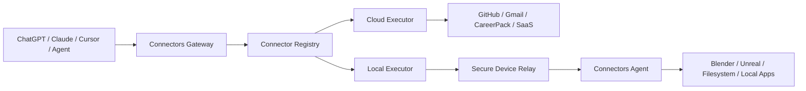

# Connectors Gateway

A runtime gateway that lets AI clients call both **cloud applications** and **local desktop software** through one normalized connector layer.

This repository is intentionally separate from [`rahmanef63/connectors`](https://github.com/rahmanef63/connectors).

- `connectors` = cookbook / SSOT / recipes.
- `connectors-gateway` = runtime / product / execution layer.

## Product thesis

An AI client should not need to know whether an action is executed through REST, OAuth, MCP, WebSocket, a local socket, or an application SDK.



The gateway exposes one public HTTPS surface to AI clients. Local machines never need to expose a public IP or inbound port.

## Core invariant

**Public AI clients talk only to the gateway. Local software talks only to the local agent. The local agent establishes an outbound encrypted connection to the gateway.**

Never expose Blender's local socket directly to the internet.

## Repository layout

```text
apps/       web (dashboard) · gateway (public MCP/API) · agent (local daemon)
packages/   core · registry · protocol · auth · policy · executor · schemas · sdk · observability
adapters/   blender (local) · remote-mcp (cloud)
plugin/     universal ChatGPT/Codex package plus Claude compatibility package
docs/       architecture, security model, connector contract, roadmap
```

`git ls-files` is the map. Nothing here is generated, so nothing here can rot.

## MVP

The first release proves two execution models with one gateway:

1. **CareerPack** — remote/cloud connector.
2. **Blender** — local connector through the Connectors Agent.

If both work through the same normalized connector contract, the architecture is ready for more integrations.

## First implementation target

```text
ChatGPT
   │ HTTPS / MCP
   ▼
Gateway
   ├── CareerPack adapter ──► CareerPack API/MCP
   │
   └── Blender adapter
           │
           ▼
      Device Relay
           │ outbound WSS
           ▼
      Connectors Agent
           │ localhost only
           ▼
      Blender bridge/add-on
```

## Stack

| Layer | Choice | Why |
|---|---|---|
| Workspace | Bun 1.3 workspaces | packages ship TypeScript source, so there is no build step to keep in sync |
| Gateway | one `Bun.serve` process | HTTP (MCP + REST) and the device-relay WebSocket in the same process, so dispatching a job is an in-process call, not a second hop |
| Local agent | Bun **or** Node 22 | it runs on a user's machine — global `fetch`/`WebSocket` only, no runtime lock-in |
| Control plane | Convex (self-hosted) | devices, pairing, connections, policy, audit |
| Dashboard | Next.js 16 App Router + React 19 + Tailwind v4 | `proxy.ts`, not `middleware.ts` |
| Job signing | Ed25519 (WebCrypto) | agents verify with a public key; no shared secret ever lands on a user's machine |
| Credential hashing | PBKDF2-SHA256 (WebCrypto) | one implementation that runs in Bun, Node and the Convex runtime |

One runtime dependency outside the framework layer: `ajv`, for JSON Schema validation.

## Run it locally

```bash
bun install
cp .env.example .env

# mint the Ed25519 keypair the gateway signs job envelopes with
bun run --cwd apps/gateway keygen

bun run dev:web        # dashboard      → http://localhost:3000
bun run dev:gateway    # gateway + relay → http://localhost:8787
bun run dev:agent      # local agent (needs `bun run --cwd apps/agent pair` first)
```

Checks:

```bash
bun run validate                  # typecheck + unit tests
bun run test:convex               # convex-test + slice tests
bun run verify:remote-endpoints   # credential-free live OAuth discovery check
```

The dashboard and the Convex functions need a Convex deployment; see
[`docs/12-deployment.md`](./docs/12-deployment.md).

## Status

Live since 2026-08-15:

| | |
|---|---|
| Dashboard | <https://connectors.rahmanef.com> |
| Gateway (MCP + REST + device relay) | <https://connect.rahmanef.com> |

### Connecting a client

Authorization is **OAuth 2.1 + PKCE with open dynamic registration** — there is no key
to paste. A client with no token gets a 401 carrying a `resource_metadata` pointer,
walks the two `/.well-known` documents, registers itself, sends the user through the
consent screen, and exchanges the code for a token. See
[`docs/18-oauth.md`](./docs/18-oauth.md). `plugin/` packages the same endpoint for
ChatGPT, Codex, and Claude; see
[`docs/19-chatgpt-codex-plugin.md`](./docs/19-chatgpt-codex-plugin.md).

**Hosted ChatGPT registration is still pending.** The runtime and package are tested, but
ChatGPT must create a real `plugin_asdk_app...` technical ID before `.app.json` can be
added and an end-to-end web round trip can be claimed.

Phases 0–4 are implemented and unit-tested. The approval queue binds consent to one exact
call, spends it once, expires it after ten minutes, and removes stale rows in bounded hourly
maintenance. The cloud path is proven against the live stack — the gateway reaches Convex
and the pairing challenge round-trips. No device has paired and no job has been dispatched
yet. [`docs/13-mvp-roadmap.md`](./docs/13-mvp-roadmap.md) tracks what is done, what is
partial, what is proven, and the one remaining horizontal-scaling gap.
[`docs/12-deployment.md`](./docs/12-deployment.md) has the deployment topology — note
that the Dokploy application named `connectors-gateway` is the *dashboard*, and the
gateway is `connect-gateway`.

Read [`AGENTS.md`](./AGENTS.md) before implementation.
