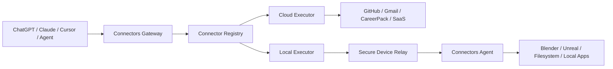

# Connectors Gateway

A runtime gateway that lets AI clients call both **cloud applications** and **local desktop software** through one normalized connector layer.

This repository is intentionally separate from [`rahmanef63/connectors`](https://github.com/rahmanef63/connectors).

- `connectors` = cookbook / SSOT / recipes.
- `connectors-gateway` = runtime / product / execution layer.

## Product thesis

An AI client should not need to know whether an action is executed through REST, OAuth, MCP, WebSocket, a local socket, or an application SDK.



The gateway exposes one public HTTPS surface to AI clients. Local machines never need to expose a public IP or inbound port.

## Core invariant

**Public AI clients talk only to the gateway. Local software talks only to the local agent. The local agent establishes an outbound encrypted connection to the gateway.**

Never expose Blender's local socket directly to the internet.

## Repository layout

```text
connectors-gateway/
├── apps/
│   ├── web/                # dashboard
│   ├── gateway/            # public MCP/API gateway
│   └── agent/              # local desktop/daemon agent
├── packages/
│   ├── core/
│   ├── registry/
│   ├── protocol/
│   ├── auth/
│   ├── policy/
│   ├── executor/
│   ├── schemas/
│   ├── sdk/
│   └── observability/
├── adapters/
│   ├── blender/
│   └── careerpack/
├── docs/
├── examples/
└── .github/
```

## MVP

The first release proves two execution models with one gateway:

1. **CareerPack** — remote/cloud connector.
2. **Blender** — local connector through the Connectors Agent.

If both work through the same normalized connector contract, the architecture is ready for more integrations.

## First implementation target

```text
ChatGPT
   │ HTTPS / MCP
   ▼
Gateway
   ├── CareerPack adapter ──► CareerPack API/MCP
   │
   └── Blender adapter
           │
           ▼
      Device Relay
           │ outbound WSS
           ▼
      Connectors Agent
           │ localhost only
           ▼
      Blender bridge/add-on
```

Read [`AGENTS.md`](./AGENTS.md) before implementation.
