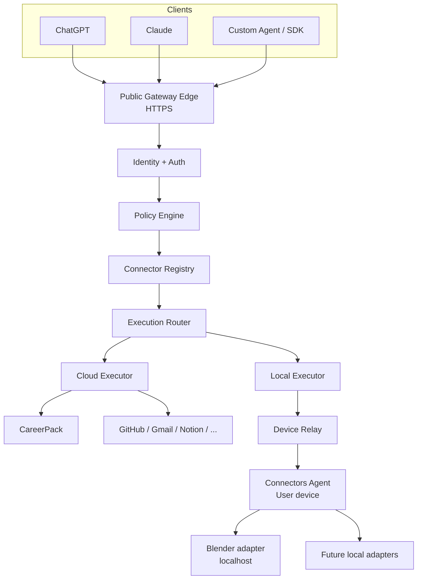

# Architecture

## High-level topology



## Control plane vs data plane

### Control plane

Owns configuration:

- users;
- organizations/workspaces;
- connectors installed;
- OAuth connections;
- paired devices;
- action permissions;
- policies;
- connector versions;
- revocation.

### Data plane

Handles execution:

1. receive action request;
2. authenticate caller;
3. resolve user/workspace;
4. resolve connector;
5. check policy;
6. route cloud vs local;
7. execute;
8. normalize result;
9. audit.

## Why local apps do not need a public IP

The local agent maintains an **outbound** encrypted session to the gateway.

The gateway never initiates a TCP connection to the user's laptop.

```text
User PC ───── outbound TLS/WSS ─────► Gateway
Gateway ───── message over session ─► User PC
```

From a firewall/NAT perspective, the device behaves like an ordinary client connecting to a website.

## Transport boundaries

| Boundary | Recommended transport |
|---|---|
| AI → Gateway | HTTPS, MCP and/or REST |
| Gateway → Cloud app | HTTPS/API/remote MCP |
| Gateway ↔ Local Agent | authenticated WSS or equivalent persistent secure channel |
| Local Agent → Blender bridge | loopback TCP/HTTP/socket only |
