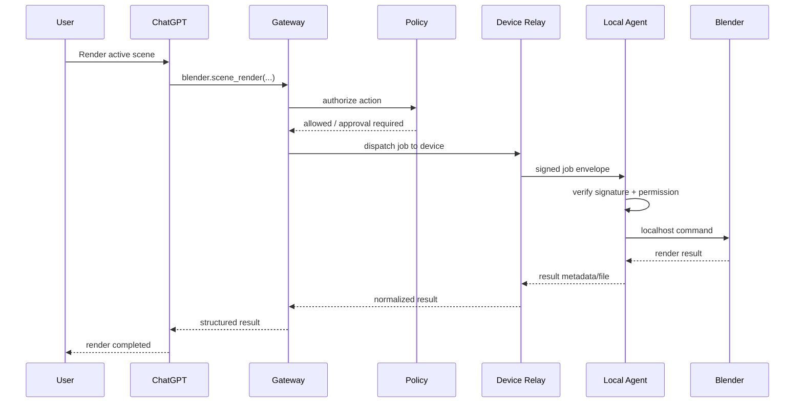
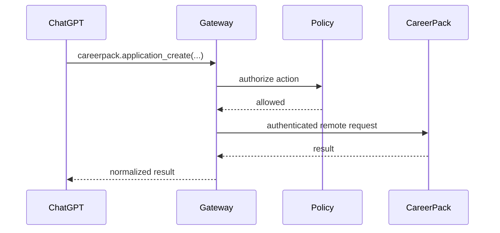

# Request flow

## Example: render Blender scene

User asks ChatGPT:

> Render the active Blender scene using the main camera.

### Flow



## Example: CareerPack cloud action



## Router decision

```text
connector.executor == "cloud"
    → CloudExecutor

connector.executor == "local"
    → LocalExecutor
    → resolve device
    → DeviceRelay
```

The AI should not branch on this distinction.
