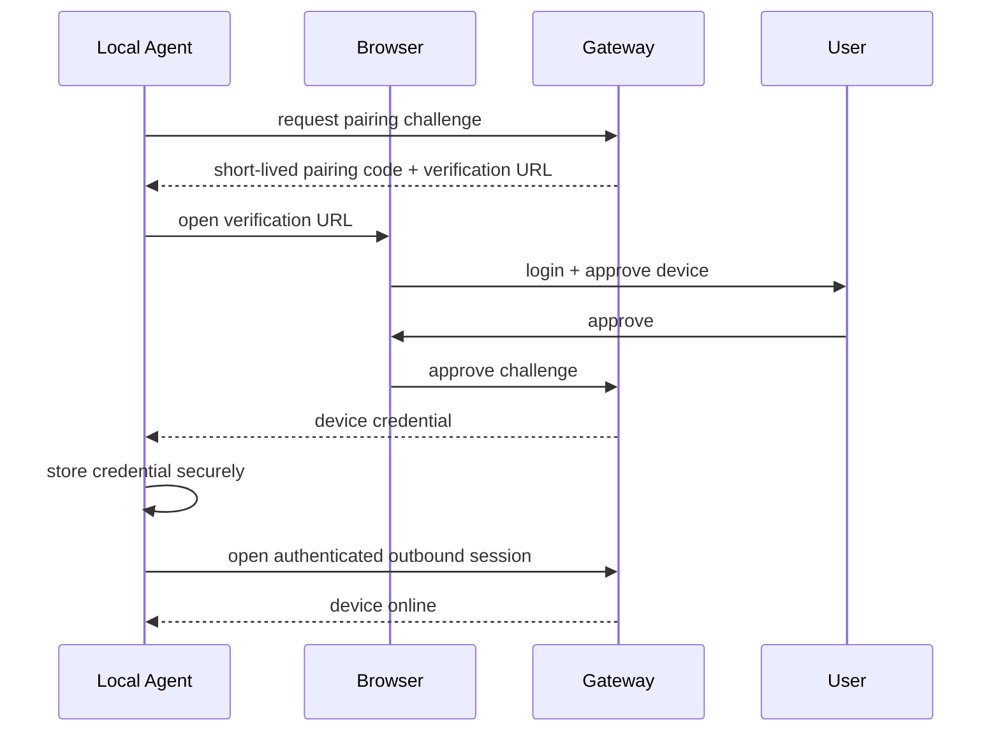

# Device pairing

## Goal

Associate one local agent installation with one user/workspace without exposing machine credentials to the AI client.

## Recommended flow



## Device record

Minimum conceptual fields:

```ts
type Device = {
  id: string
  userId: string
  workspaceId?: string
  displayName: string
  platform: "windows" | "macos" | "linux"
  status: "online" | "offline" | "revoked"
  credentialVersion: number
  lastSeenAt?: string
  capabilities: string[]
}
```

## Rules

- Pairing codes are short-lived and one-time use.
- A device credential is never shown to ChatGPT.
- Revoking a device terminates its active session. The single-process relay polls durable
  device status every 30 seconds, removes the socket from dispatch before closing it, fails
  in-flight jobs with `DEVICE_REVOKED`, and closes the agent with WebSocket code 4003.
- Device credentials should be rotatable.
- A user can rename a device without changing its identity.
- Reinstalling the agent should create a new device unless recovery is explicitly implemented.


## Device CRUD lifecycle

The dashboard exposes device CRUD without allowing arbitrary device-row creation:

```text
Create  = agent starts pairing -> human approves -> agent claims once
Read    = signed-in owner lists their paired devices
Update  = owner renames display metadata; identity/credential do not change
Revoke  = terminal credential/session termination (security lifecycle)
Delete  = owner may permanently forget only an already-revoked device
```

Delete never substitutes for revoke. `forget` refuses an online/offline device, removes the
revoked device and any one stale relay route atomically, and retains the opaque device id in the
audit trail. A forgotten machine must pair again and receives a new device identity/credential.
