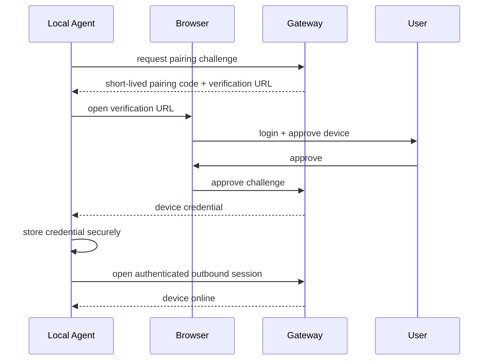

# Device pairing

## Goal

Associate one local agent installation with one user/workspace without exposing machine credentials to the AI client.

## Recommended flow



## Device record

Minimum conceptual fields:

```ts
type Device = {
  id: string
  userId: string
  workspaceId?: string
  displayName: string
  platform: "windows" | "macos" | "linux"
  status: "online" | "offline" | "revoked"
  credentialVersion: number
  lastSeenAt?: string
  capabilities: string[]
}
```

## Rules

- Pairing codes are short-lived and one-time use.
- A device credential is never shown to ChatGPT.
- Revoking a device terminates its active session.
- Device credentials should be rotatable.
- A user can rename a device without changing its identity.
- Reinstalling the agent should create a new device unless recovery is explicitly implemented.
