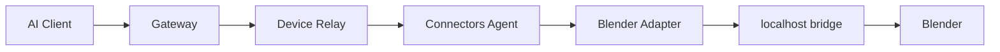

# Blender reference connector

## Purpose

Blender is the MVP proof for local execution.

## Topology



## Critical rule

Do not expose Blender's bridge port to the public internet.

Expected network model:

```text
Blender bridge:
127.0.0.1:<local-port>

Connectors Agent:
outbound encrypted connection → Gateway
```

## Safe MVP action surface

Start narrow:

```text
blender.scene.inspect
blender.scene.render
blender.object.list
blender.object.create
blender.object.transform
blender.material.list
blender.material.apply
blender.file.export
```

Optional later:

```text
blender.object.delete
blender.asset.import
blender.camera.configure
blender.light.configure
```

Disabled by default:

```text
blender.python.execute
blender.shell.execute
blender.filesystem.raw
```

## Adapter responsibilities

- detect Blender availability;
- detect bridge/add-on version;
- translate normalized action → Blender bridge call;
- validate paths;
- enforce timeouts;
- normalize Blender errors;
- return files through the gateway file/result mechanism;
- never accept arbitrary code for ordinary actions.

## Capability report

Example:

```json
{
  "connector": "blender",
  "status": "available",
  "version": "4.x",
  "adapter_version": "0.1.0",
  "capabilities": [
    "scene.inspect",
    "scene.render",
    "object.create",
    "object.transform"
  ]
}
```

## Render flow

For large output files, prefer:

1. local render;
2. agent uploads result to controlled gateway object storage;
3. gateway returns a short-lived result reference to the AI client.

Do not push arbitrary local filesystem paths into model-visible output.
