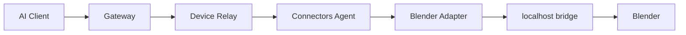

# Blender reference connector

## Purpose

Blender is the MVP proof for local execution.

## Topology



## Critical rule

Do not expose Blender's bridge port to the public internet.

Expected network model:

```text
Blender bridge:
127.0.0.1:<local-port>

Connectors Agent:
outbound encrypted connection → Gateway
```

## Action surface and adapter responsibilities

`adapters/blender/README.md` lists both against the code that actually ships — the
shipped action ids with their risk tiers, the three actions that are never implemented
(absent, not present-and-disabled), and what the adapter owes the gateway. This file does
not restate them, so the two cannot disagree.

## Capability report

Example:

```json
{
  "connector": "blender",
  "status": "available",
  "version": "4.x",
  "adapterVersion": "0.1.0",
  "capabilities": [
    "scene.inspect",
    "scene.render",
    "object.create",
    "object.transform"
  ]
}
```

## Render flow

For large output files, prefer:

1. local render;
2. agent uploads result to controlled gateway object storage;
3. gateway returns a short-lived result reference to the AI client.

Do not push arbitrary local filesystem paths into model-visible output.
