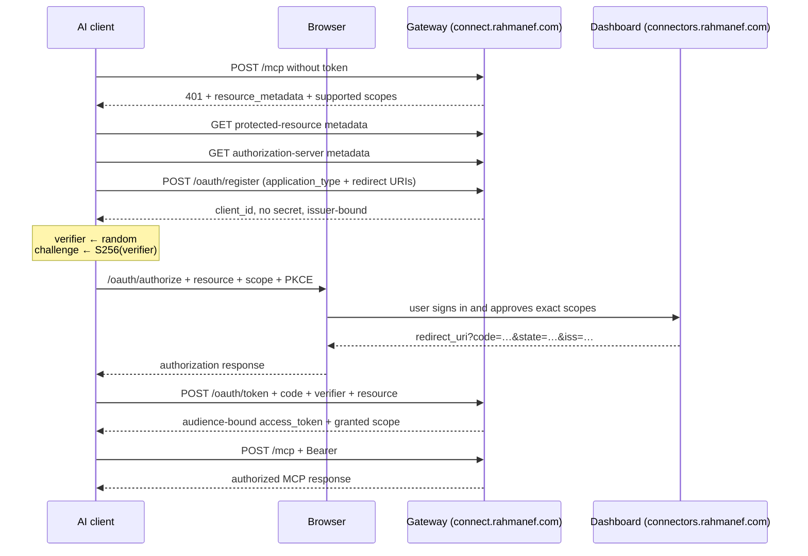

# OAuth 2.1 and MCP discovery

How a ChatGPT, Codex, Claude, or other MCP client obtains a user-scoped token
without copying a secret by hand. The authorization server supports public
clients only, PKCE S256, dynamic client registration, least-privilege consent,
and audience-bound access tokens.

Companion to [07 — MCP gateway](./07-mcp-gateway.md) for transport behavior and
[08 — auth and identity](./08-auth-and-identity.md) for the meaning of an issued
credential.

## Handshake

The first `401` is the discovery handshake, not a dead end. Its
`WWW-Authenticate` challenge points to protected-resource metadata and names the
scope vocabulary the client may request.

## Endpoint placement

| Endpoint | Host | Reason |
| --- | --- | --- |
| `/.well-known/oauth-protected-resource` | gateway | It describes the exact `/mcp` protected resource |
| `/.well-known/oauth-protected-resource/mcp` | gateway | Path-aware discovery alias for MCP clients |
| `/.well-known/oauth-authorization-server` | gateway | Its `issuer` is the trusted gateway origin |
| `POST /oauth/register` | gateway | Public-client DCR, no browser session |
| `POST /oauth/token` | gateway | Machine exchange, no browser session |
| `GET /oauth/authorize` | dashboard | The only step that requires login and human consent |

`GATEWAY_PUBLIC_URL` is required in production. Discovery, DCR issuer binding,
RFC 9207 `iss`, and token resource validation all derive from this configured
origin, never from attacker-influenced proxy headers.

## Security properties

### Public clients and PKCE

Every registered AI host is public; no client secret is issued or accepted.
`token_endpoint_auth_methods_supported` is `none`. Authorization codes are bound
to an S256 PKCE challenge, expire quickly, are stored only as digests, and are
single-use. A failed valid-shape exchange burns the code by returning `{ok:
false}` from the Convex transaction rather than throwing and rolling back the
delete.

### Least-privilege scopes

The supported vocabulary is:

- `mcp.read` for actions whose manifest says `readOnly: true`;
- `mcp.write` for every action that can change an external system or device.

The authorization request is parsed once, normalized, shown on the consent
screen, revalidated on the mutation, stored on the code, revalidated at token
exchange, persisted on the API-key row, returned in the token response, and used
by the dynamic catalog. An older client that omits `scope` receives both scopes
to preserve compatibility; a client that explicitly asks for `mcp.read` receives
a read-only token.

Regression tests fail when a shipped action omits the scope implied by its safety
annotation or requires a scope the issuer cannot grant.

### Resource and audience binding

The MCP resource is the canonical public URL ending in `/mcp`. The authorization
and token requests carry RFC 8707 `resource`; an explicit different target is
rejected as `invalid_target`. New OAuth API-key rows store that value as their
audience.

`authenticateCaller` accepts an audience-bound token only for the exact MCP
resource. The same token is rejected on REST endpoints or another MCP audience.
Manual API keys remain unbound and keep their existing REST/MCP behavior.

For rolling compatibility, a legacy client that omits `resource` is bound to the
configured `/mcp` endpoint rather than receiving an unbound token.

### Authorization-server issuer binding

DCR accepts RFC 7591 `application_type` (`web` or `native`) and stores the
configured authorization-server issuer with the client ID. Native clients may
use loopback HTTP redirect URIs; public hosts still require HTTPS.

Both the read-side consent query and the write-side approval mutation reject a
client ID registered to another issuer. The authorization response includes RFC
9207 `iss` on success and denial, and token exchange checks the same issuer again.
Pre-migration client rows are bound to the issuer on their first successful
consent.

### Redirect URIs

- Allowed: HTTPS, HTTP only on loopback, and reverse-DNS private-use schemes.
- Refused: fragments, public HTTP, `javascript:`, relative paths, malformed URLs,
  and non-canonical spellings.
- Matching is exact string membership, never prefix or subdomain matching.
- A malformed authorization request ends on the consent page; it is never
  redirected to an unverified URI merely to report an error.

### Token lifecycle

An OAuth token is an expiring `apiKeys` row, so the gateway authenticates it with
the same code path and the dashboard revokes it with the existing API-key UI.
Only one live token exists per `(user, client)`: reconnecting revokes that
client's previous token without touching another client such as ChatGPT or
Claude. No refresh token is currently issued; the client repeats authorization
when the 90-day token expires.

## Protocol compatibility

The OAuth layer serves both initialize-based MCP clients and stateless MCP
`2026-07-28`. Authentication happens before either protocol body is dispatched.
The modern transport additionally validates protocol, method, and name headers
against body metadata; see [07](./07-mcp-gateway.md).

## Deployment order

This release changes both the Convex control-plane mutation contract and the
public gateway. Deploy in this order:

1. deploy the dashboard/Convex schema and functions;
2. verify the new OAuth mutation arguments are live;
3. deploy the gateway;
4. verify discovery, DCR, authorization, token exchange, and one authenticated
   `tools/list` round trip;
5. only then register or refresh the hosted ChatGPT connection.

Do not deploy the gateway first. The new gateway sends `resource`, `issuer`, and
`applicationType` to Convex; the old control plane correctly rejects unknown
arguments. The optional schema fields preserve existing rows and in-flight codes,
but they do not make an old service contract accept a new request shape.

## Operations and tests

- Discovery documents are public, static, CORS-open, cacheable, and exempt from
  the shared edge limiter.
- Registration and token endpoints have their own tighter OAuth limiter.
- Expired codes and never-used clients are pruned by the bounded hourly OAuth
  sweep; a client with `lastUsedAt` is retained.
- Root runtime validation, the full Convex/web suite, and the production Next.js
  build run in CI.

## Still open

- Hosted ChatGPT registration must create the real `plugin_asdk_app…` technical
  ID before `plugin/.app.json` can be committed. A placeholder is forbidden by a
  package test.
- Client ID Metadata Documents are the preferred direction in MCP `2026-07-28`;
  DCR remains the implemented compatibility path. Adding CIMD requires a bounded,
  SSRF-safe metadata fetch and is intentionally not faked.
- There is no separate consent-revocation screen; OAuth grants remain visible and
  revocable under API keys.
- Unit, integration, package, and production-build verification are complete, but
  a real hosted ChatGPT OAuth round trip has not yet been completed.
