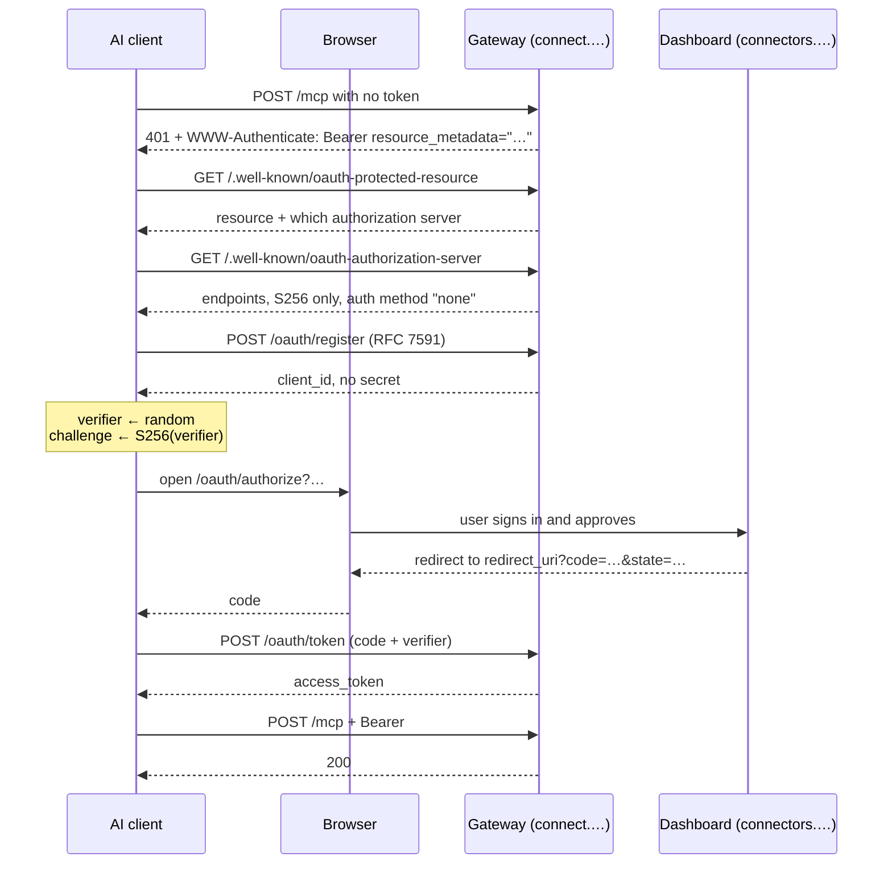

# 18 — OAuth 2.1 and MCP discovery

How an AI client with no credential ends up holding one. Phase 1 of this server
was bearer-only: real tokens, but a human had to mint one in the dashboard and
paste it somewhere. That works for a plugin config file and for nothing else —
neither claude.ai's connector form nor ChatGPT's connection modal has a field to
paste a key into, and neither has one to paste a client id into either.

Companion to [07 — MCP gateway](./07-mcp-gateway.md) (the transport) and
[08 — auth and identity](./08-auth-and-identity.md) (what a credential means
once you have one).

## The handshake

The 401 is not a failure. It is the handshake starting, and `resource_metadata`
is the entire reason a client can walk itself from "unauthorized" to "connected"
without a human copying anything.

## Where each piece lives, and why

| Endpoint | Host | Why there |
|---|---|---|
| `/.well-known/oauth-protected-resource` | **gateway** | A client probes the host of the MCP URL. Serving it on the dashboard looks right in a browser and is never fetched |
| `/.well-known/oauth-authorization-server` | **gateway** | RFC 8414: the issuer must match where the document was found |
| `POST /oauth/register` | **gateway** | Machine-to-machine, no session |
| `POST /oauth/token` | **gateway** | Machine-to-machine, no session |
| `GET /oauth/authorize` | **dashboard** | The only step that needs a human and a login |

`GATEWAY_PUBLIC_URL` is **required in production**. Every discovery document
embeds it, and it cannot be derived from the request: behind a proxy the `Host`
and `X-Forwarded-*` headers are attacker-influenced, and a client that trusted a
spoofed `issuer` would carry its authorization code to someone else's token
endpoint.

## Decisions worth knowing before you change anything

**The access token is an `apiKeys` row.** An OAuth grant *is* a user-scoped,
expiring API key, so `authenticateCaller` reads it with no second branch, the
dashboard lists it with no second screen, and revoking it uses the button that
already exists. A dedicated token table would have duplicated all three. The one
thing this required was making `expiresAt` cross to the gateway in
`_shared/api_key_record.ts` — the expiry is enforced by `authenticateCaller` and
nowhere else, so a field dropped there would be an expiry stored and never
applied.

**Every client is public; there are no client secrets.** An AI host runs from
software the user installed and cannot keep one. PKCE S256 binds the code to the
requester instead. `token_endpoint_auth_methods_supported` says `["none"]` so a
client does not send a secret this server would ignore.

**A rejected exchange is RETURNED, not thrown.** A Convex mutation is one
transaction. The first version of `redeemCode` deleted the code and then threw on
a bad verifier — and the rollback restored the row, leaving a stolen code live
for the next attempt. `{ok: false}` commits the delete; the gateway converts it
to `invalid_grant`. This is the same trap as the rolled-back error-log insert in
[09](./09-policy-and-approvals.md), and it will catch the next person too.

**`scopes_supported` is deliberately absent.** No connector manifest declares
`requiredScopes` and API keys are issued with `scopes: []`, so any scope string
advertised here would gate nothing — and telling a client it holds a restricted
token when it does not is worse than saying nothing. Authority is bounded by the
policy engine and the approval queue. Add a scope here the day a manifest
declares one, and not before.

**Discovery is exempt from the edge rate limiter.** A hosted AI client reaches
this gateway from a handful of shared egress addresses for all of its users, and
metering the first thing every one of them fetches lets one busy tenant make the
server undiscoverable for everybody — presenting as "this server does not
support OAuth". Safe because both documents are static, secret-free and
`max-age=3600`. `/oauth/register` and `/oauth/token` are metered, harder than
the edge, by `oauthLimiter`.

**One live token per (user, client).** Reconnecting replaces that client's
previous token rather than adding one. It matches what "reconnect" means to a
user, and it stops repeated consents from growing the table. Other clients are
untouched: revoking Claude must not sign out ChatGPT.

## Redirect URI handling

The highest-consequence check in the system, because the browser delivers the
authorization code to whatever URI passes it.

- Allowed: `https` anywhere, `http` **only** on loopback (a native client on a
  random port), and reverse-DNS private-use schemes (`com.example.app://`) per
  RFC 8252.
- Refused: fragments, non-loopback `http`, `javascript:`, relative paths, and
  any string that does not equal its own `URL` round-trip.
- Matching is **exact string membership**. Not prefix, not host, not subdomain —
  each of those has a published bypass.
- A malformed request is a **dead end on the consent page**, never a redirect.
  Bouncing the browser to an unverified URI in order to report an error is the
  open redirect, and it is reachable before anyone has approved anything.

## Protocol versions

`initialize` now echoes the client's own revision when we speak it —
`2024-11-05`, `2025-03-26`, `2025-06-18` — instead of answering everyone with
one pinned string, which was legal but let older clients disconnect rather than
downgrade.

Not implemented: `2025-11-25` (icons) and `2026-07-28`, the current revision,
which is a stateless rewrite with no `initialize` handshake and a mandatory
`server/discover`. That is a transport change, not a version string.

## Still open

- **No refresh tokens.** Tokens last 90 days and a client re-runs the flow. A
  short TTL without refresh would only train the user to click Approve weekly,
  which is worse than the long TTL.
- **No `resource` indicator (RFC 8707).** One gateway, one resource today.
- **No consent revocation screen of its own** — grants appear under API keys,
  which is where they are revoked.
- **Untested against a real client.** The flow is verified by unit and
  integration tests and by hand against the deployed discovery documents; it has
  not yet completed a round trip with claude.ai or ChatGPT.
